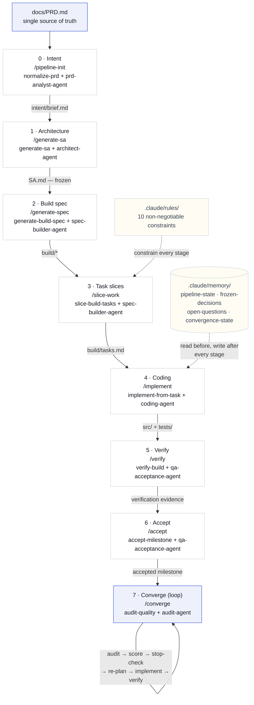

# Pipeline Components Reference

Detailed reference for every moving part of the delivery pipeline under `.claude/`:
what each agent and skill does, what it reads, what it produces, and where its
authority stops.

For the narrative of a real run, see [Case-Study.md](Case-Study.md). For stage
definitions, see [Workflow.md](Workflow.md).

---

## 1. How a stage is built

Every stage is **three files**, each with one job:

| File | Role | Answers |
| --- | --- | --- |
| `.claude/commands/<name>.md` | **Command** — the entry point | *What can I invoke?* |
| `.claude/skills/<name>/SKILL.md` | **Skill** — the execution guide | *How is it done?* |
| `.claude/agents/<name>.md` | **Agent** — the role owner | *Who owns the decision?* |

Two layers cut across all stages:

- **`.claude/rules/`** — non-negotiable constraints the agents cannot override.
- **`.claude/memory/`** — durable state that makes any run resumable.

This separation is why adding the entire convergence phase meant writing one
command, one skill, and one agent — not rewiring the pipeline.

## 2. Diagrams

Rendered inline below (Mermaid, rendered natively by GitHub). The same diagrams are
also kept as PlantUML source for other toolchains:
[`diagrams/pipeline-flow.puml`](diagrams/pipeline-flow.puml) ·
[`diagrams/pipeline-sequence.puml`](diagrams/pipeline-sequence.puml) — render those with
[plantuml.com](https://www.plantuml.com/plantuml) or `java -jar plantuml.jar docs/diagrams/*.puml`.

### 2.1 Pipeline flow

Gates enforced in stage 7: tests · coverage · mutation · lint · types · complexity.
A regression guard reverts any round that worsens a gate; stop conditions
(converged / plateau / budget) guarantee termination.

### 2.2 One run, as a sequence

```mermaid
sequenceDiagram
    actor Dev as Developer
    participant CMD as Command
    participant AG as Agent
    participant SK as Skill
    participant SPEC as specs/
    participant MEM as memory/

    Dev->>CMD: /seechen --run
    CMD->>MEM: read pipeline-state.md
    MEM-->>CMD: current stage, blockers

    loop each stage 0 to 6
        CMD->>AG: activate the stage's role owner
        AG->>SK: load the stage's execution guide
        SK->>SPEC: read frozen upstream artifact
        SPEC-->>SK: inputs (brief / SA / build spec)
        SK->>SPEC: write stage output
        AG->>MEM: update pipeline-state + frozen-decisions
    end
    CMD-->>Dev: milestone accepted

    Note over CMD,MEM: Each stage is three files:<br/>command (entry) + skill (how) + agent (who)

    Dev->>CMD: /converge --run
    CMD->>MEM: read convergence-state.md

    loop until converged / plateau / budget
        CMD->>AG: audit-agent
        AG->>SK: audit-quality
        SK->>SK: run gates — tests, coverage, mutation,<br/>lint, types, complexity
        SK->>SPEC: write specs/audit/round-N.md
        alt gate unmeasurable or genuinely ambiguous
            AG->>Dev: escalate for a decision
            Dev-->>AG: choice
        else actionable finding
            AG->>SK: re-plan minimal change
            SK->>SPEC: implement + verify
            AG->>AG: revert round if a gate regressed
        end
        AG->>MEM: update convergence-state.md
    end
    CMD-->>Dev: CONVERGED — all gates pass
```

## 3. Stage map

| Stage | Command | Skill | Agent | Output |
| --- | --- | --- | --- | --- |
| 0 Intent | `/pipeline-init` | `normalize-prd` | `prd-analyst-agent` | `specs/intent/brief.md` |
| 1 Architecture | `/generate-sa` | `generate-sa` | `architect-agent` | `specs/architecture/SA.md` |
| 2 Build spec | `/generate-spec` | `generate-build-spec` | `spec-builder-agent` | `specs/build/*` |
| 3 Task slices | `/slice-work` | `slice-build-tasks` | `spec-builder-agent` | `specs/build/tasks.md` |
| 4 Coding | `/implement` | `implement-from-task` | `coding-agent` | `src/`, `tests/` |
| 5 Verify | `/verify` | `verify-build` | `qa-acceptance-agent` | verification evidence |
| 6 Accept | `/accept` | `accept-milestone` | `qa-acceptance-agent` | `specs/acceptance/*` |
| 7 Converge | `/converge` | `audit-quality` | `audit-agent` | `specs/audit/*` |

---

## 4. Agents — who owns each decision

Agents define **ownership and judgement**, not procedure. Each stays 80–120 lines
(a map, not a warehouse) and links to deeper docs on demand.

### `prd-analyst-agent` — Stage 0

**Mission.** Turn a prose PRD into a compact, unambiguous intent brief that
downstream architecture work can rely on.

- **Owns** — scope interpretation, non-goals, constraint extraction, acceptance framing.
- **Reads** — `docs/PRD.md`, `docs/Workflow.md`.
- **Produces** — `specs/intent/brief.md`.
- **Must not** — invent product requirements the PRD does not support, or resolve
  a genuine product ambiguity silently.
- **Escalates when** — the PRD is contradictory in a way that blocks architecture.

### `architect-agent` — Stage 1

**Mission.** Freeze the system architecture so implementation cannot drift.

- **Owns** — module boundaries, public API shape, extension points, runtime
  lifecycle, cross-cutting constraints, and the set of **frozen decisions**.
- **Reads** — `specs/intent/brief.md`.
- **Produces** — `specs/architecture/SA.md`.
- **Must not** — leak implementation detail that belongs in the build spec, or
  leave a boundary ambiguous that downstream stages must assume.
- **Escalates when** — a required architectural choice has no basis in the intent brief.

### `spec-builder-agent` — Stages 2–3

**Mission.** Convert frozen architecture into contracts a coding agent can follow
literally, then cut them into safe, ordered work.

- **Owns** — interface contracts, file plan, artifact schema, failure policy, test
  matrix; then task sequencing, file ownership, and per-task test expectations.
- **Reads** — `specs/architecture/SA.md`, `specs/intent/brief.md`.
- **Produces** — `specs/build/*` and `specs/build/tasks.md`.
- **Must not** — redesign the architecture, or emit an artifact the project scale
  doesn't justify (see the doc-scope rule).
- **Escalates when** — the architecture leaves a contract underspecified.

### `coding-agent` — Stage 4

**Mission.** Implement exactly what the task slices specify, without quietly
redesigning the system.

- **Owns** — source and test implementation, adherence to interface and artifact
  contracts, recording deviations.
- **Reads** — `specs/build/tasks.md`, `specs/build/*`.
- **Produces** — `src/`, `tests/`, plus notes in `memory/implementation-log.md`.
- **Must not** — change architecture boundaries, public interfaces, failure
  policies, or artifact contracts on its own initiative.
- **Escalates when** — a slice cannot be implemented as written; the conflict goes
  to memory *before* continuing.

### `qa-acceptance-agent` — Stages 5–6

**Mission.** Prove the implementation satisfies the build spec, then decide
milestone acceptance on explicit evidence.

- **Owns** — verification planning and execution, defect and risk reporting,
  acceptance criteria, the delivered / deferred / blocked distinction.
- **Reads** — `specs/build/test-matrix.md`, `specs/build/tasks.md`, `src/`, `tests/`,
  `memory/implementation-log.md`.
- **Produces** — verification evidence, `specs/acceptance/criteria.md`, `specs/acceptance/report.md`.
- **Must not** — introduce new requirements, accept undocumented deviations
  casually, or replace evidence with reassurance.
- **Escalates when** — acceptance would depend on an unverifiable claim.

### `audit-agent` — Phase 7 (convergence loop)

**Mission.** Given a milestone that already passes, find what the tests do not
catch, and turn it into a scored, evidence-backed change plan.

- **Owns** — objective gate measurement, evidence-cited subjective scoring,
  finding severity, the per-round report, and the stop-condition call.
- **Reads** — `.claude/docs/Convergence-Loop.md`, `specs/build/*`, `specs/architecture/SA.md`,
  `src/`, `tests/`, `memory/convergence-state.md`, `memory/frozen-decisions.md`.
- **Produces** — `specs/audit/round-<n>.md`, updated `memory/convergence-state.md`,
  and a minimal change set.
- **Must not** — loosen a test or gate to raise a score, report an unmeasured gate
  as a pass, or change a frozen decision.
- **Escalates when** — a fix is a genuine design trade-off, touches a frozen
  decision or public API, or a gate cannot be measured at all.

---

## 5. Skills — how each stage is executed

Skills hold the **procedure**: trigger conditions, required inputs, steps,
outputs, guardrails. They stay small and link out rather than inlining reference
material.

### `normalize-prd` — Stage 0

Convert the PRD into a compact intent pack that freezes scope, constraints,
entities, and acceptance framing.

- **Use when** — a PRD exists and architecture has not started.
- **Reads / writes** — `docs/PRD.md` → `specs/intent/brief.md`.
- **Guardrail** — preserve unresolved product choices in `memory/open-questions.md`
  rather than guessing them away.

### `generate-sa` — Stage 1

Generate the architecture document and freeze the main design boundaries.

- **Use when** — the intent pack exists and is stable.
- **Reads / writes** — `specs/intent/brief.md` → `specs/architecture/SA.md`.
- **Guardrail** — state frozen decisions explicitly; downstream stages may not
  re-litigate them.

### `generate-build-spec` — Stage 2

Produce the implementation-facing build-spec layer from the intent pack and
architecture.

- **Use when** — `SA.md` is frozen.
- **Reads / writes** — `SA.md` + `brief.md` → `specs/build/*` (module map,
  interfaces, file plan, artifact schema, failure policy, test matrix).
- **Guardrail** — choose the artifact set from the actual project boundary; justify
  each artifact that exists and each one omitted.

### `slice-build-tasks` — Stage 3

Split the build spec into small ordered tasks with file ownership and test
expectations.

- **Use when** — the build spec is frozen.
- **Reads / writes** — `specs/build/*` → `specs/build/tasks.md`.
- **Guardrail** — every slice names its files, prerequisites, and required tests, so
  implementation never has to infer scope.

### `implement-from-task` — Stage 4

Implement code and tests from one frozen task slice.

- **Use when** — a specific slice is ready and its prerequisites are done.
- **Reads / writes** — `tasks.md` + `specs/build/*` → `src/`, `tests/`.
- **Guardrail** — no silent redesign; deviations are recorded in
  `memory/implementation-log.md` before continuing.

### `verify-build` — Stage 5

Validate implementation against the build spec and record evidence, defects, and
fix-loop notes.

- **Use when** — code and tests exist for one or more slices.
- **Reads / writes** — `test-matrix.md`, `tasks.md`, `src/`, `tests/` → verification
  evidence + `memory/implementation-log.md`.
- **Guardrail** — do not mark verification complete while required tests fail;
  record failures as evidence rather than summarizing them away.

### `accept-milestone` — Stage 6

Generate acceptance criteria and an evidence-based acceptance report.

- **Use when** — verification evidence exists.
- **Reads / writes** — verification evidence + `brief.md` + `specs/build/*` →
  `specs/acceptance/criteria.md`, `specs/acceptance/report.md`.
- **Guardrail** — separate blocked items from deferred scope; keep residual risk
  visible even when acceptance passes.

### `audit-quality` — Phase 7

Run one hardening round: measure gates, score axes on cited evidence, write the
round report.

- **Use when** — a milestone already passes and the convergence loop needs a round.
- **Reads / writes** — `Convergence-Loop.md`, `specs/*`, `src/`, `tests/` →
  `specs/audit/round-<n>.md` + `memory/convergence-state.md`.
- **Guardrail** — every gate result is a real tool run or a recorded `unmeasured`
  reason; every subjective score cites files and lines; fixes stay minimal.

---

## 6. Commands — the entry surface

| Command | Purpose |
| --- | --- |
| `/seechen` | **Unified entry point.** Accepts stage flags (`--run`, `--sa`, …), control flags (`--from`, `--only`, `--refresh`), or natural language. |
| `/converge` | Post-acceptance hardening loop (`--run`, `--resume`, `--auto`, `--attended`). |
| `/pipeline-init` … `/accept` | Per-stage entry points, used internally by `/seechen`. |
| `/prd-pipeline` | Deprecated alias for `/seechen`. |

Users normally only need `/seechen` and `/converge`.

## 7. Rules — the guardrails

Ten constraints in `.claude/rules/` that agents cannot override:

| Rule | Enforces |
| --- | --- |
| `workflow` / `branch` / `branch-selection` | Task-appropriate branches; never commit routine work to `main`. |
| `commit` | Conventional Commits with transparent AI attribution. |
| `doc-scope` | Derive the artifact set from the real project boundary, not a fixed checklist. |
| `agent-skill-design` | Agents and skills stay compact, navigational, docs-backed (80–120 lines). |
| `summary-sync` | Update durable state after every completed stage. |
| `system-constraint-language` | Reusable constraint files are written in English. |
| `ai` | AI-assisted decisions are documented, specs updated alongside code. |
| `exceptions` | The narrow, documented cases where the above may be bypassed. |

## 8. Memory — why runs are resumable

| File | Holds |
| --- | --- |
| `pipeline-state.md` | Stage status, progress, current situation, next action, blockers. |
| `frozen-decisions.md` | Contracts that downstream stages may not re-open. |
| `open-questions.md` | Unresolved choices preserved instead of guessed. |
| `implementation-log.md` | Deviations and fix-loop notes from coding. |
| `convergence-state.md` | Loop round, score history, open findings, stop reason. |

A run reads memory before starting and writes it after each step, so it continues
from the last completed stage instead of restarting.

## 9. Design principles

1. **Separation of concerns.** Command = entry, skill = how, agent = who. Any one
   can be swapped without touching the others.
2. **Maps, not warehouses.** Orchestration files stay small and link to deeper
   docs, so context cost stays low.
3. **Freeze before you build.** Architecture freezes before build specs; build
   specs before code. Downstream never re-litigates upstream.
4. **Escalate, don't guess.** Unresolved choices go to memory and to the human,
   never into a silent assumption.
